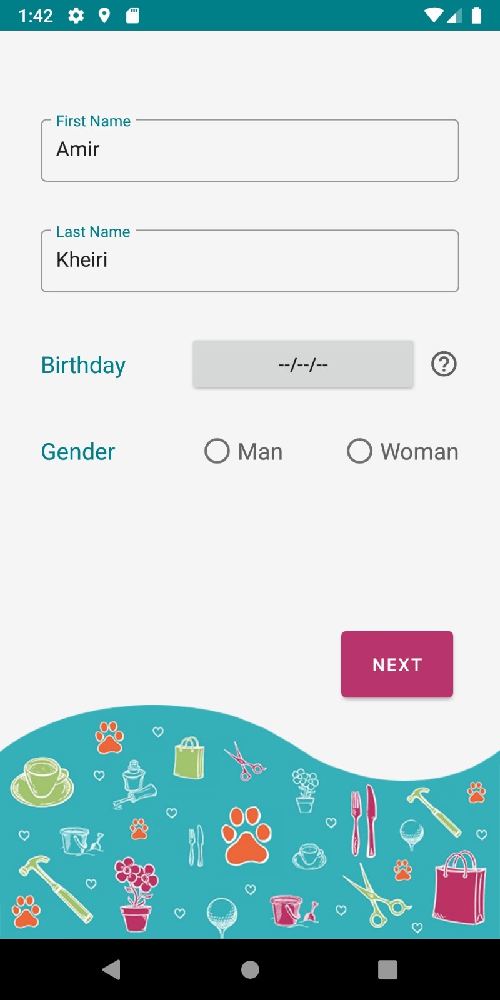
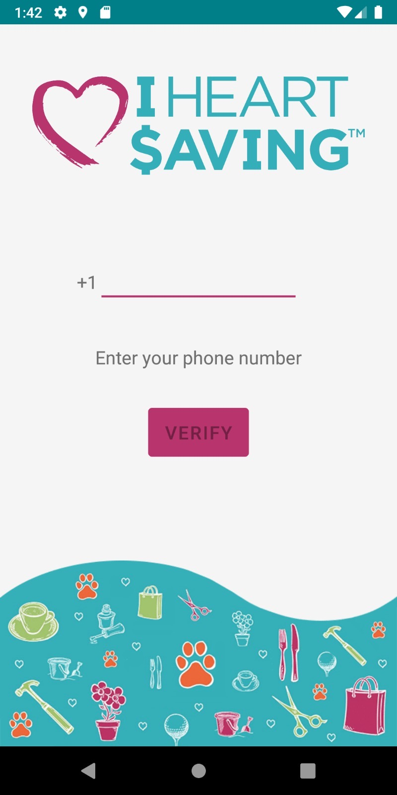
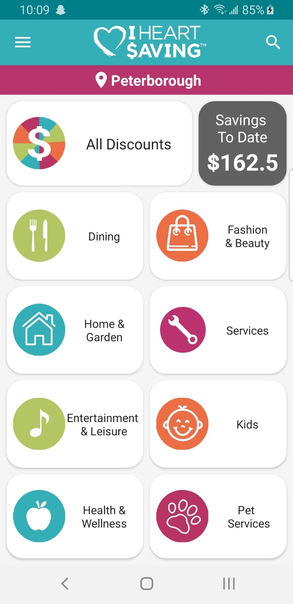
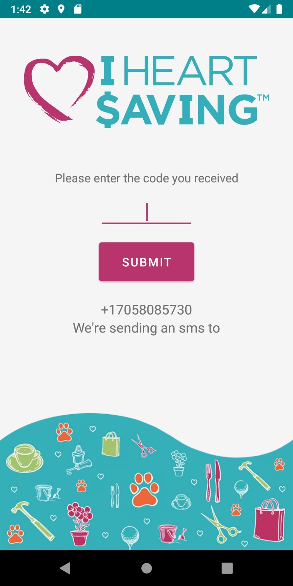
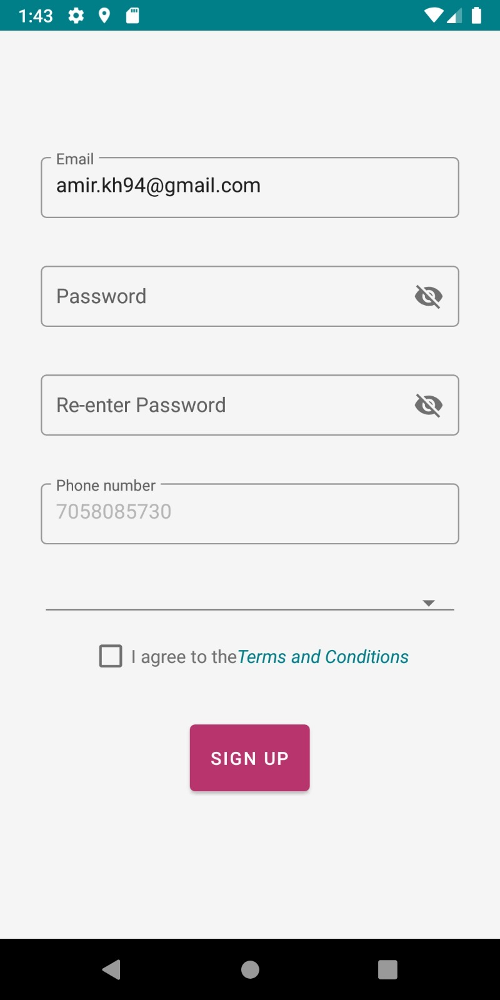

# I Heart Saving 🎁✨

## Overview

**I Heart Saving** 🚀 is a demo project showcasing a platform designed to empower users with exclusive discounts and special offers through a yearly membership model. This project serves as a prototype for a mobile-first e-commerce application, developed to encourage local shopping while offering significant savings to users.

This demo is implemented using **Node.js** 💻 for the backend and **Native technologies** 📱 for the mobile applications. The primary goal is to demonstrate a seamless experience for users looking to access and utilize local business discounts.

---

## Features

### 1. **Annual Membership** ⏳💳
Users can purchase an annual membership at a fixed cost. This membership grants them access to exclusive discounts and special offers from over 150 partnered local businesses. By joining the platform, users become eligible for various benefits, including discounts on:

- Products from local stores 🏢🍪
- Services such as dining, fitness, and more 🍔🏏
- Daily essentials and lifestyle purchases 🌄🎎

### 2. **Utilizing Discounts and Offers** 🔑✨
Once registered as a member, users can:

- Browse a wide array of offers from local businesses through the app. 🌐
- Use special codes or vouchers to redeem discounts directly while shopping or availing services. 🛒🔹
- Save significantly on their expenses with the potential to save up to $5,000 annually. 💸

The platform simplifies the process by providing a user-friendly interface to explore, compare, and redeem offers.

---

## Technical Stack

### Backend:
- **Node.js**: Provides a scalable and efficient API to handle business logic and data transactions. 🌐🔧

### Mobile Applications:
- **Native iOS and Android Apps**: Built using native technologies to deliver a high-performance and responsive user experience. 📲📱

---

## Screenshots 🌄

1. 
1. 
1. 
1. 
1. 

*Note: Placeholder for screenshots. These will be added later.*

---

## Demo Notes 🔧

This project is a demo application and is not intended for production use. The purpose is to showcase the core features and design approach of the I Heart Saving platform.

For any inquiries or feedback regarding this demo, please feel free to reach out. 🙏

---

## Social Media 🔍

Follow us on Instagram for the latest updates: [I Heart Saving Instagram](https://www.instagram.com/myiheartsaving/) 📸

---

### Developed By ✍️
This project was developed by **Sina Khanjani**, specializing in backend and mobile application development.
